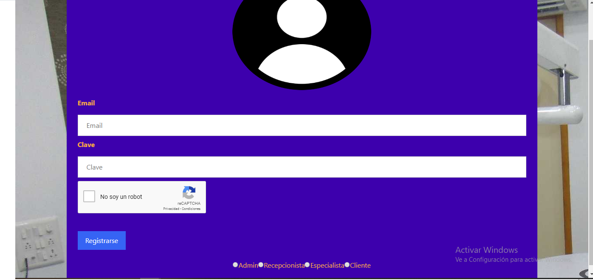
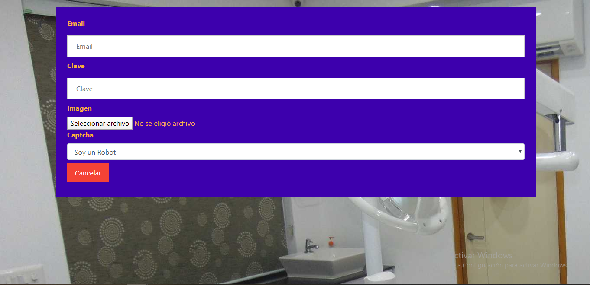
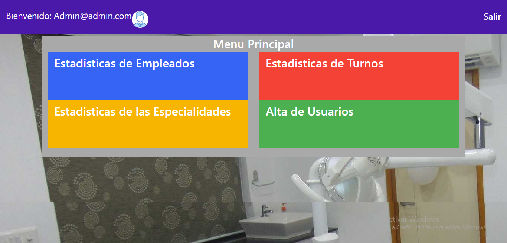
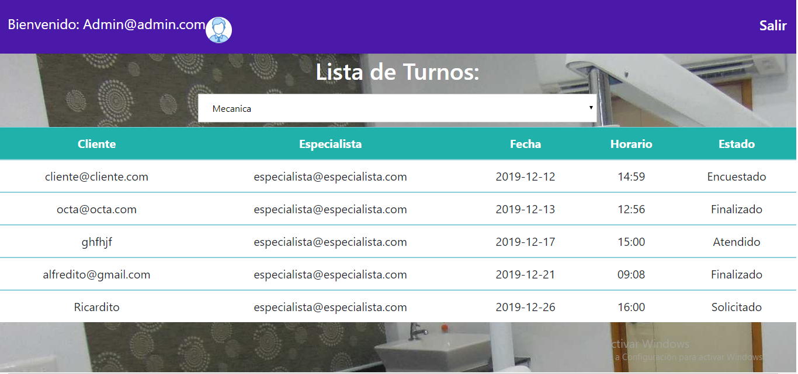
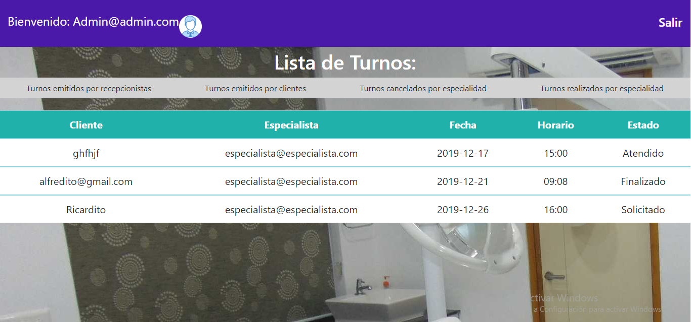
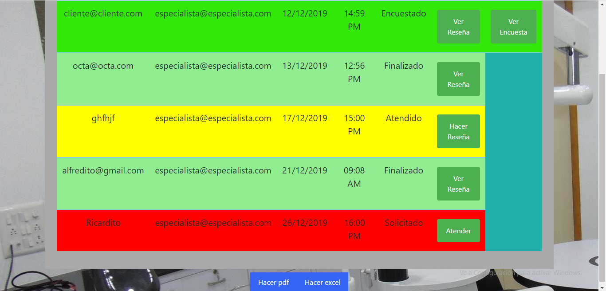
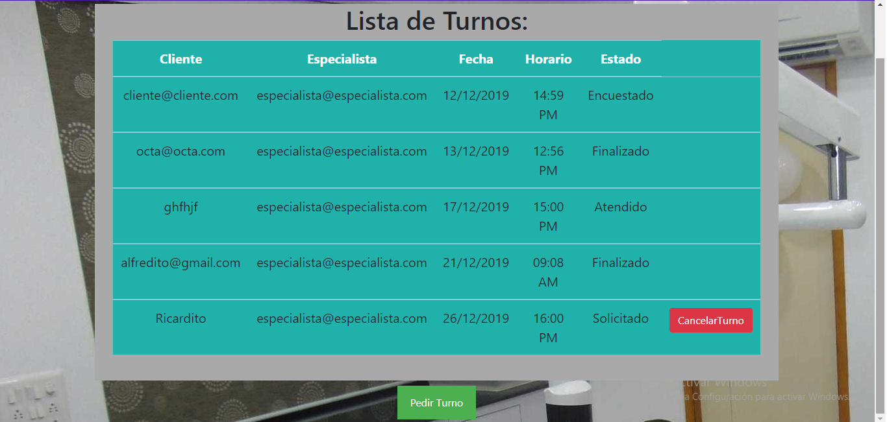
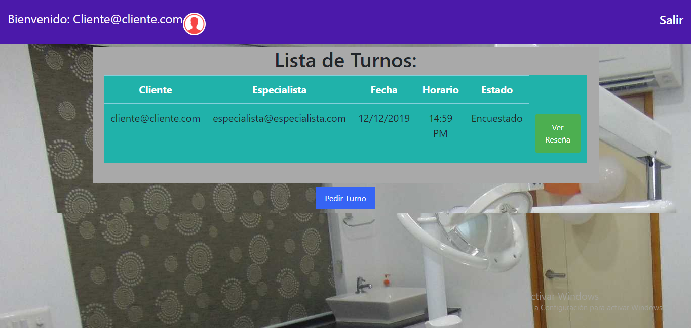

# Buena Sonrisa

# https://DucauArley.github.io/BuenaSonrisa/.

## Login
Se puede ingresar a la pagina ya sea con un usuario propio o con los botones
de abajo que autocompletan el email y la contraseña

## Registro
Página para registrar solamente clientes

## Principal Admin
En esta página se podran elegir las estadisticas a visualizar y registrar
un nuevo usuario, ya sea un especialista, un recepcionista o un cliente

### Estadisticas Empleados
Aqui se pueden ver los turnos dependiendo de las especialidades

### Estadisticas Turnos
Aqui se pueden ver distintas opciones sobre los turnos: los emitidos por 
recepcionistas, los emitidos por clientes, los cancelados por especialidad
y los finalizados por especialidad

### Estadisticas Especialidades
Aqui se pueden ver las especialidades mas y menos usadas, y una lista de 
las encuestas

## Principal Especialista
En esta página, se le mostrara una tabla de todos los turnos que tiene y 
tuvo al especialista, y este podra atenderlos, escribir una reseña, leer
esa reseña, leer la encuesta que haya hecho el usuario, descargar un archivo
pdf y descargar un archivo excel

## Principal Recepcionista
Aqui se muestran todos los turnos que no esten cancelados, ademas se podran 
pedir turnos para clientes que no esten registrados y cancelar turnos solicitados

## Principal Cliente
En esta página, se veran los turnos correspondientes al cliente, tambien podra
ver las recenias que hagan los especialistas y podran hacer encuestas de 
satisfaccion
